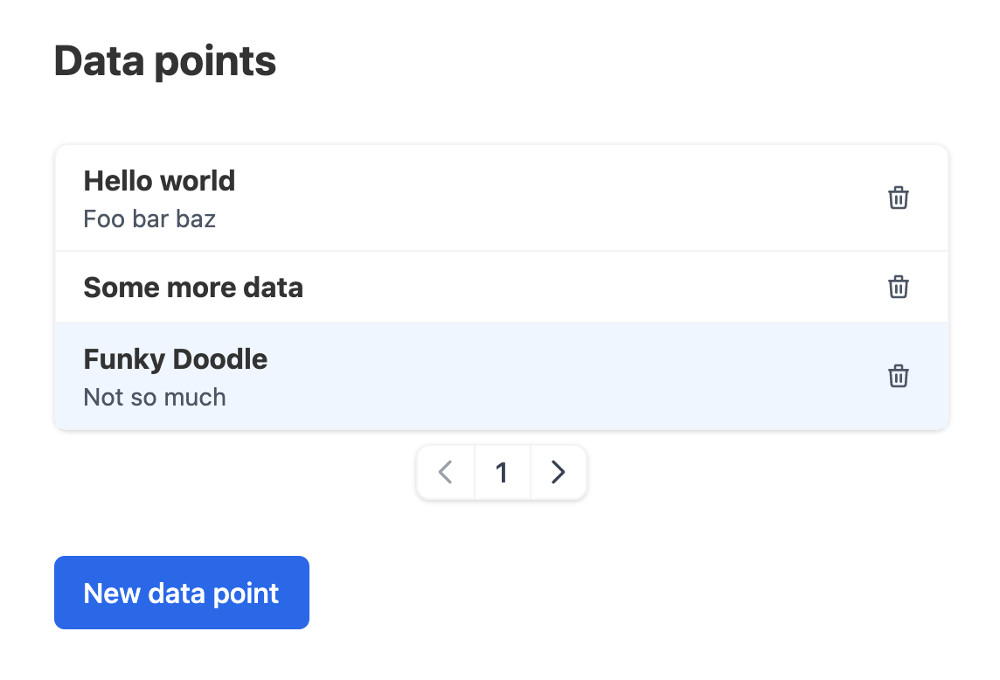

# Stefans solution to Weld's frontend coding challenge



## How to run

**Install dependencies**
```sh
$ npm install
```

**Run app**
```sh
$ npm run start
```

**Run tests**
```sh
$ npm run test
```

## Approach

### Loading states

Loading states are used in several places. 
A page spinner is used when resolving lazy loaded routes, such as the edit and create pages.
Spinners on buttons are used in several places when waiting for the result of some async behaviour such as deleting a list entry or create a new entry.
Furthermore, the list page will render a list skeleton as an animated placeholder while waiting for an api response.

### Create and Edit pages

A form provider and a shared form component have been created with the purpose of being shared across the create and edit pages.
Very simple html5 validation is used on the title field.

### Undo feature

The undo feature has been implemented in `hooks/useUndo.tsx`.
It consists of an UndoProvider component which keeps a list of items that have been deleted and can be re-added on demand. The list functions as a stack, i.e. `last-in-first-out`.
The feature has been implemented with react's provider pattern to make the feature available on both the list page and the edit page.
To fulfill the challenge requirement of only making items undoable within a timeframe of 10 seconds I have implemented a timeout behaviour which makes sure to purge items that have "expired".
The strategy is to only purge the list when necessary instead of fx. running in set intervals. A timer delay is continuously being calculated based on the oldest item in the list, i.e. the next candidate to be purged. When the timer expires the purge will run which in turn will result in the calculation of a new timer delay for the next iteration until the list is empty.

**Tests** can be found in `hooks/useUndo.test.tsx`. The interplay between the `UndoProvider` and the consumer contexts was quite challenging and time consuming to get to work. It works as intended, but could be revisited in **future-work**.

The **UI/UX** for this feature is very simple and leaves something to be desired. A simple button will be shown on the list page whenever there are deleted items that can be undone. The button only displays the text "Undo" along with the number of items that can be undone (this number will decrease as items expire or the undo button is clicked). 
An alternative idea for **future work** could be to let undoable items remain in the list and render them toned down and with a dedicated undo button. In this way they will only disappear once they actually expire.

Another **short-coming** is that any given item that has been deleted and then undone will always be added to the end of list. To change this would require changes to the API as well and is out of scope for this project.

### Pagination feature

A pagination hook, `hooks/usePagination.ts`, has been implemented which offers basic pagination functionality. It keeps a current page state and returns a slice of the complete data list based on a specified page size (set to **3** for convenience) and the current page number. Additionally, it takes measures to ensure that the current page is never out of bounds.

**Tests** can be found in `hooks/usePagination.test.tsx`. 

Pagination creates a problem of selecting an appropriate initial page when coming back to the list page after having visited the create or edit pages. To fix this I have introduced a app wide context, `FocusItemContext`, which keeps an id reference to an item that should be focused in the list. The list page attemps to resolve the focused item and call `setPageByIndex` with the index of the focused item in the list and thereby selecting the appropriate initial page.

---
<br/>
<br/>
<br/>
<br/>
<br/>
<br/>
<br/>
<br/>

# Welcome to Weld's frontend coding-challenge

## Introduction

At Weld we use TypeScript, [Create React App](https://create-react-app.dev/), [TailwindCSS](https://tailwindcss.com/) and [Apollo GraphQL](https://www.apollographql.com/) for our frontend application, so this project also reflects that. On our back-end we use NestJS.

Fork this repository and create your own repository to get started.

## Challenge

You will build a few new features on the app in the repository. The app currently shows a list of data points that each has two fields: text and id. It uses a fake api inspired by Apollo located in src/fakeApollo.tsx. Right now the app only supports showing and removing of data points.

### Steps in challenge

- Add a description field to the data points
- The fake internet speed in the fake api is pretty slow, so some loading states might be needed
- Make the app support adding of new data points through another page on /new (use useReducer for managing the internal state of this page) (use react-router-dom for routing)
- It should be possible to clear any field with a click on a button
- The form should be validated
- If you add a lot of data points to the list, it would probably be nice with some pagination
- The app should also support editing the title and description of the data points on the route /edit/:id
- When deleting a data point, it should be possible to regret and restore it within 10 seconds in some way
- Make a components structure that you think makes sense for the app
- Use tailwindcss for styling, don't write any custom css

## How we evaluate

The test is solely for you to show techniques and design patterns you normally use. Once the techniques and design patterns have been demonstrated then that is enough. No neeed for additional boilerplate. Just include a future work section in your answer and we will include questions in the technical interview.

- We understand that this can be **time consuming**. If you are short on time - then leave something out. But be sure to tell us your approach to the problem in the documentation.
- A documented answer that explains your approach, short-comings, how-to-run and future work.
- We appreciate small commits with a trail of messages that shows us how you work.
